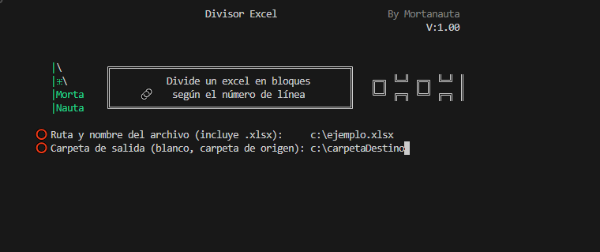

#  &nbsp;&nbsp;   Excel Splitter   

##  `Excel Splitter` para dividir archivos Excel en partes más pequeñas

# Introducción

Este programa permite dividir un archivo Excel (`.xlsx`) en varios archivos más pequeños según el número de filas especificado por el usuario. Es una herramienta útil para gestionar grandes conjuntos de datos de manera más manejable.

# Contenidos:

    CortarExcel.py: - Código en Python (en español)
    ExcelSplitter.py: - Código en Python (en inglés)

# Características

- Divide archivos Excel en partes más pequeñas.
- Mantiene la cabecera en cada archivo generado.
- No requiere instalación de módulos adicionales.
- Fácil de usar e intuitivo.
- Probado en: Gnu-Linux y Windows

# Instalación

Descarga la versión que mejor se adapte a tus necesidades y sistema operativo.

# Capturas de pantalla

(*Captura de pantalla de la interfaz del programa en uso*)

# Inicio Rápido

Al ejecutarse, el programa solicita al usuario que introduzca la ruta del archivo Excel que desea dividir, así como la carpeta de salida para los archivos generados. También se le pedirá que especifique el número de filas por archivo.

El programa divide el archivo Excel en partes, asegurándose de que cada archivo contenga la cabecera original. Los archivos generados se guardan en la carpeta especificada o, si se deja en blanco, en la misma carpeta que el archivo original.

Para detener la ejecución, simplemente cierra la ventana o presiona **Ctrl+C**.

# Conclusión

Este programa es una herramienta sencilla y eficaz para dividir archivos Excel grandes en partes más manejables, lo que facilita su análisis o compartición. Es ideal para usuarios que necesitan gestionar grandes volúmenes de datos de manera eficiente.
