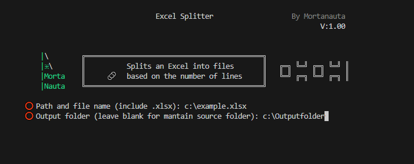

#  &nbsp;&nbsp;   Excel Splitter   

##  `Excel Splitter` for dividing Excel files into smaller parts

# Introduction

This program allows you to split an Excel file (`.xlsx`) into several smaller files based on the number of rows specified by the user. It is a useful tool for managing large datasets more effectively.

# Contents:

    CortarExcel.py: - Python code (in Spanish)
    ExcelSplitter.py: - Python code (in English)

# Features

- Splits Excel files into smaller parts.
- Retains the header in each generated file.
- Does not require additional modules to be installed.
- Easy to use and intuitive.
- Tested on: Gnu-Linux and Windows

# Installation

Download the version that best suits your needs and operating system.

# Screenshots

(*Screenshot of the program interface in use*)

# Quick Start

When executed, the program prompts the user to enter the path of the Excel file they wish to split, as well as the output folder for the generated files. The user is also asked to specify the number of rows per file.

The program splits the Excel file into parts, ensuring that each file contains the original header. The generated files are saved in the specified folder or, if left blank, in the same folder as the original file.

To stop the execution, simply close the window or press **Ctrl+C**.

# Conclusion

This program is a simple and effective tool for dividing large Excel files into more manageable parts, making it easier to analyze or share. It is ideal for users who need to manage large volumes of data efficiently.
