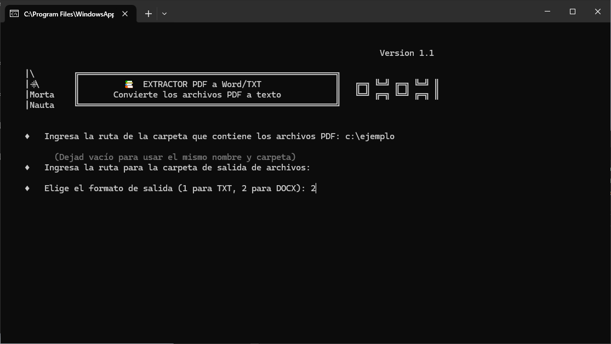
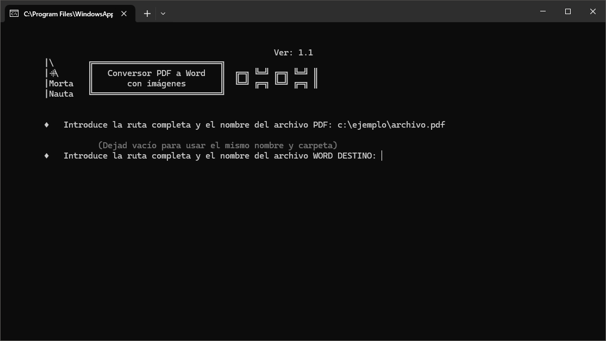

#  &nbsp;&nbsp; PDF Text Extractor & Conversor

## Extrae y convierte PDF a  `Word` o `TXT`. 

# Introducción

A fin de afrontar los problemas más habituales cuando trabajamos con PDF, en esta ocasión hemos preparado dos programas, 
 - PDF Extractor: Extrae el texto de **TODOS** los archivos de una carpeta dada y lo almacena como Word o TXT con el mismo nombre del documento PDF. En ambos casos se pierde el formato que podría tener el archivo PDF, es decir, extrae únicamente el texto.
 - PDF Conversor: Transforma un archivo PDF a Word, manteniendo formatos e imágenes. El resultado no es siempre bueno 🤨 , se recomienda revisar el archivo final.

# Contenido:
    - PDFExtractor SP.py: - Código Python (en Castellano)
    - PDFExtractor.py: - Código Python (en Inglés)
    - PDFConversor SP.py: - Código Python (en Castellano)
    - PDFConversor.py: - Código Python (en Inglés)
    - Leeme.md: - Doc. información (en Castellano) - Este documento.
    - Readme.md: - Doc. información (en Inglés)

*NOTA*: En esta ocasión **NO** habrá archivos EXE por su tamaño de compilación.

# Características

- **Extractor:** Reconoce los archivos PDF de la carpeta, ignorando al resto.
- **Extractor:** Conserva el nombre del archivo original, para mayor trazabilidad.
- **Extractor:** Indica el número de archivos convertidos y el tiempo dedicado.
- **Conversor:** Valida que la ruta introducida sea válida.
- **Conversor:** Mantiene estructura y formato del archivo original.
- **Conversor:** Si no introducimos variable final generará un archivo Word en la misma ruta y con el mismo nombre que el original.

# Instalación

    Extractor   ► pip install python-docx
                ► pip install PyPDF2
    
    Conversor   ► pip install pdf2docx

# Screenshots

&nbsp;&nbsp;&nbsp;&nbsp;&nbsp;&nbsp;&nbsp;&nbsp;&nbsp;&nbsp;(*PDF Extractor*)

&nbsp;&nbsp;&nbsp;&nbsp;&nbsp;&nbsp;&nbsp;&nbsp;&nbsp;&nbsp;(*PDF Conversor*)
# Quick Start

**Extractor**

Introduzca la ruta donde estén los archivos PDFs, seleccione una ruta para almacenar los archivos TXT o Word (o déjela en blanco para que sea la misma que origen), por último, elija entre Word o TXT como tipo de archivo de destino y espere a que el proceso finalice.

**Conversor**

Introduzca la ruta del archivo incluyendo su nombre, de igual manera introduzca la dirección del archivo destino (o déjela en blanco para mantener nombre y carpeta), espere que el proceso finalice.

# Conclusión

Dos piezas de software que nos permiten extraer, o convertir, el contenido de un PDF.
