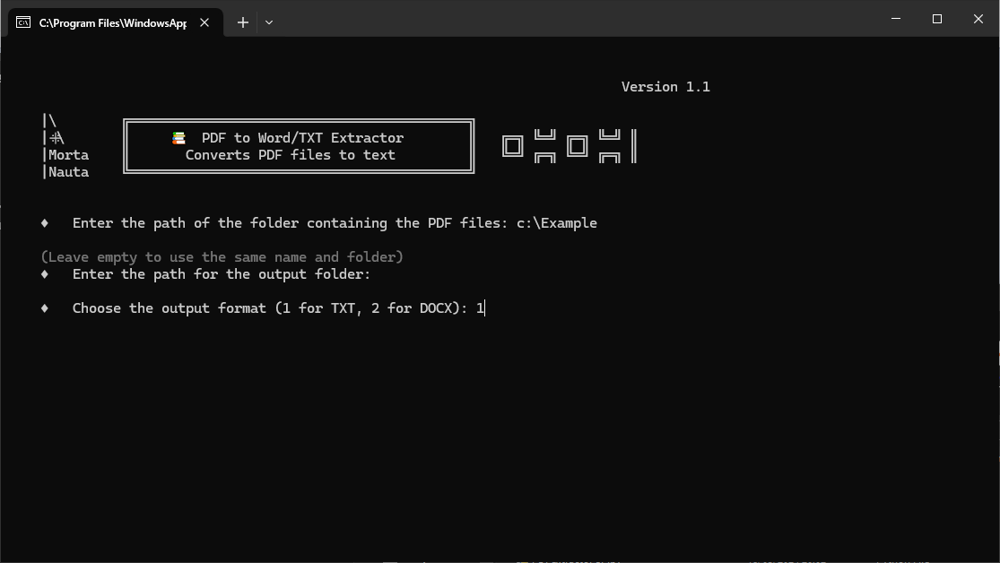
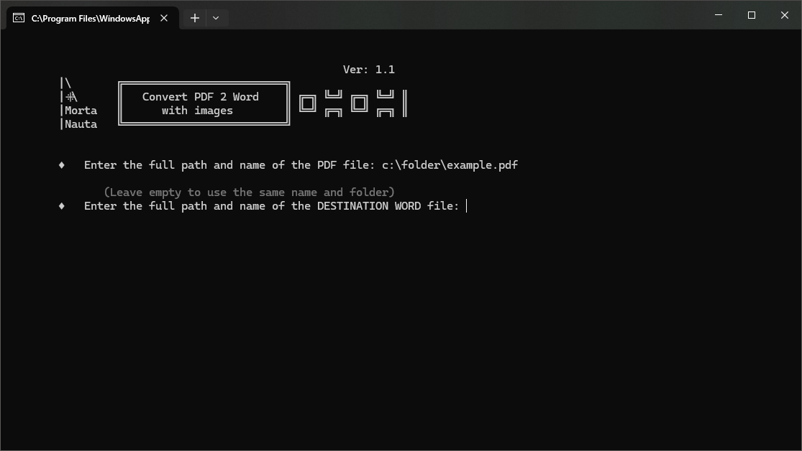

#  &nbsp;&nbsp; PDF Text Extractor & Converter

## Extracts and converts PDF to  `Word` or `TXT`. 

# Introduction

In order to address the most common issues when working with PDFs, this time we have prepared two programs:
 - PDF Extractor: Extracts the text from **ALL** files in a given folder and saves it as Word or TXT with the same name as the PDF document. In both cases, the formatting that the PDF file may have is lost, meaning it only extracts the text.
 - PDF Converter: Converts a PDF file to Word, preserving formats and images. The result is not always good 🤨 , it is recommended to review the final file.

# Contents:
    - PDFExtractor SP.py: - Python Code (in Spanish)
    - PDFExtractor.py: - Python Code (in English)
    - PDFConverter SP.py: - Python Code (in Spanish)
    - PDFConverter.py: - Python Code (in English)
    - Leeme.md: - Info Document (in Spanish) - This document.
    - Readme.md: - Info Document (in English)

*NOTE*: There will be **NO** EXE files this time due to compilation size.

# Features

- **Extractor:** Recognizes PDF files in the folder, ignoring others.
- **Extractor:** Preserves the name of the original file for traceability.
- **Extractor:** Indicates the number of files converted and the time spent.
- **Converter:** Validates that the entered path is valid.
- **Converter:** Maintains structure and format of the original file.
- **Converter:** If no final variable is introduced, it will generate a Word file in the same path and with the same name as the original.

# Installation

    Extractor   ► pip install python-docx
                ► pip install PyPDF2
    
    Converter   ► pip install pdf2docx

# Screenshots

&nbsp;&nbsp;&nbsp;&nbsp;&nbsp;&nbsp;&nbsp;&nbsp;&nbsp;&nbsp;(*PDF Extractor*)

&nbsp;&nbsp;&nbsp;&nbsp;&nbsp;&nbsp;&nbsp;&nbsp;&nbsp;&nbsp;(*PDF Conversor*)

# Quick Start

**Extractor**

Enter the path where the PDF files are located, select a path to store the TXT or Word files (or leave it blank to use the same as the source), finally, choose between Word or TXT as the destination file type and wait for the process to finish.

**Converter**

Enter the path of the file including its name, similarly enter the destination file address (or leave it blank to keep the name and folder), wait for the process to finish.

# Conclusion

Two pieces of software that allow us to extract / convert the content of a PDF.
