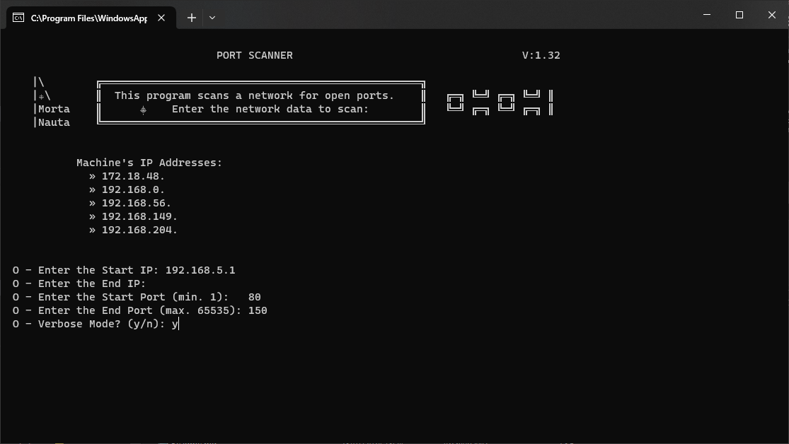

#  &nbsp;&nbsp; Port Scanner

## Port Scanner for `Windows` or `Linux`

# Introduction

Its main goal is to find and display open ports available for connections on that network.

# Contents:
    EscanerPuertos.py: - Python code (in Spanish)
    PortScanner.py: - Python code (in English)
    EscanerPuertos.zip: - Executable for Windows
    PostScanner.zip: - Executable for Windows
    Leeme.md: - Information file (in Spanish) - this document
    Readme.md: - Information file (in English) 

# Features

- Scans port range from 1 to 65535.
- Validates IP addresses (IPv4) and ports.
- Option for verbose or detailed mode.
- Detects multiple IPs on the device (Multi-LAN).
- No installation required. No additional modules needed.
- User-friendly.
- Tested on: Gnu-Linux and Windows

# Installation

Simply download the option that suits your needs.

# Screenshots

(*Final IP addresses hidden in the capture*)

# Quick Start

Upon activation, this code initiates a server that displays your system's current IP address (which may include one or more, depending on your network) along with a port number, e.g., 192.168.1.1:8000. Entering this information into your browser allows access to the files within the folder, enabling viewing, execution, or downloading.

To prevent errors, the specific location of the shared folder is prominently displayed on-screen. The server's activity is also monitored for your convenience. To terminate the server, simply press **Ctrl+C** or close the window.

# Conclusion

In essence, this code empowers you to convert your device into a simple web server, effortlessly sharing local content with other devices on your network via a web browser, enhancing ease and speed of access.
