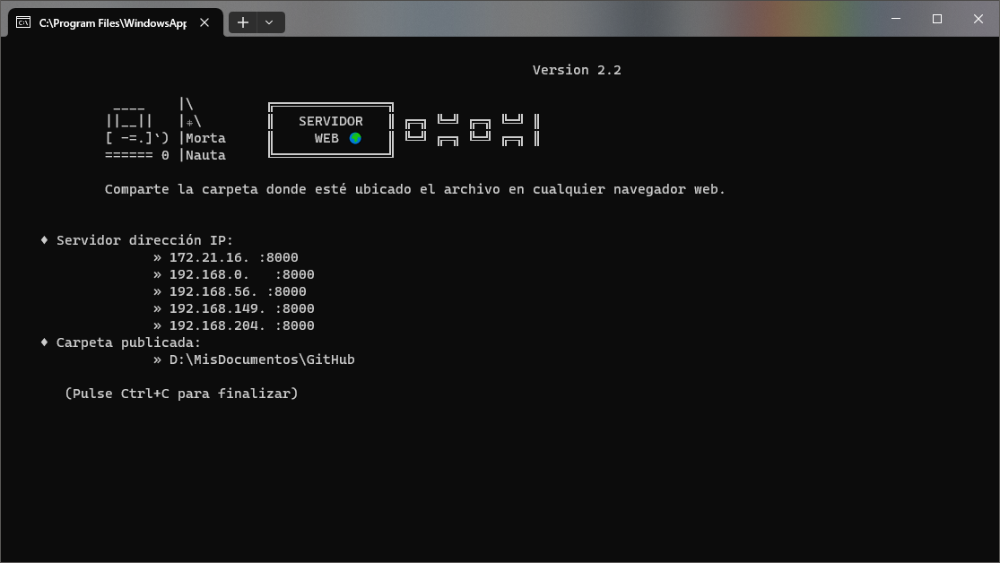

#  &nbsp;&nbsp;   WEBSERVER   

##  `Webserver` para compartir archivos en `Windows` o `Linux`

# Introducción

Esta aplicación facilita la creación de un servidor web, proporcionando acceso a través del navegador web a los contenidos dentro de la carpeta donde se ejecuta la aplicación.

# Contenidos:

    ServidorWeb.py: - Código en Python (en español)
    WebServer.py: - Código en Python (en inglés)
    ServidorWeb.zip: - Ejecutable para Windows
    WebServer.zip: - Ejecutable para Windows
    Leeme.md: - Archivo de información (en español)
    Readme.md: - Archivo de información (en inglés) - este documento

# Características

- Servidor web para compartir archivos.
- Capacidad para redes locales múltiples (Multi-LAN).
- No requiere instalación. No son necesarios módulos adicionales.
- Fácil de usar.
- Probado en: Gnu-Linux y Windows

# Instalación

Simplemente descarga la opción que se adapte a tus necesidades.

# Capturas de pantalla

(*Direcciones IP finales ocultas en la captura*)

# Inicio Rápido

Al activarse, este código inicia un servidor que muestra la dirección IP actual de tu sistema (que puede incluir una o más, dependiendo de tu red) junto con un número de puerto, por ejemplo, 192.168.1.1:8000. Ingresar esta información en tu navegador permite acceder a los archivos dentro de la carpeta, lo que posibilita la visualización, ejecución o descarga.

Para evitar errores, la ubicación específica de la carpeta compartida se muestra de manera destacada en pantalla. La actividad del servidor también se monitorea para tu conveniencia. Para detener el servidor, simplemente presiona **Ctrl+C** o cierra la ventana.

# Conclusión

En esencia, este código te permite convertir tu dispositivo en un servidor web simple, compartiendo sin esfuerzo contenido local con otros dispositivos en tu red a través de un navegador web, mejorando la facilidad y velocidad de acceso.
